  

  

---

## 🌐 Socials

### Connect with me:

---

## 💻 Tech Stack

### Languages and Tools:

<table align="center">
<tr>
<td valign="top" width="33%" align="center">

<h3>🎨 FRONTEND DEVELOPER</h3>

</td>
<td valign="top" width="33%" align="center">

<h3>🗄️ DATABASE / VERSION CONTROL</h3>

</td>
<td valign="top" width="33%" align="center">

<h3>⚙️ OTHER LANGUAGES</h3>

</td>
</tr>
<tr>
<td valign="top" align="center">

<h3>📷 CREATIVE</h3>

</td>
<td valign="top" align="center">

<h3>🛠️ EDITORS</h3>

</td>
<td valign="top" align="center">

<h3>🌱 LEARNING</h3>
<code>Software Architecture</code>

</td>
</tr>
</table>

---

## 👨‍💻 About me

Systems engineer student.

- 🌱 I am currently learning software architecture.
- 👯 Development of WEB and Mobile Applications.
- 📫 How to contact me: [Sandinowork16@gmail.com](mailto:Sandinowork16@gmail.com)
- 😄 Portfolio: [portfolio-gioxs.vercel.app](https://portfolio-gioxs.vercel.app/)
- 📷 Photography lover.
- ⚡ Fun fact: I never thought I would become a programmer!

## 🚀 Skills

<table align="center"><tr>
<td align="center">🤝 <b>Trabajo en equipo</b></td>
<td align="center">⚡ <b>Proactividad</b></td>
<td align="center">👑 <b>Liderazgo</b></td>
<td align="center">💬 <b>Trato con personas</b></td>
<td align="center">✅ <b>Responsabilidad</b></td>
<td align="center">📷 <b>Fotografía</b></td>
<td align="center">🎬 <b>Edición de fotos y videos</b></td>
</tr></table>

---

